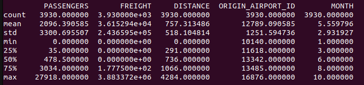
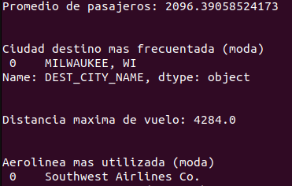

# Instrucciones de uso

- Para ejecutar el archivo correspondiente a la parte practica 1 basta con ejecutar el comando "make run1".
    - Al ejecutarse, se despliega en pantalla el Dataframe completo, luego el Dataframe tras la limpieza de datos, y posteriormente un analisis estadistico de los datos, como el promedio, la desviacion estandar, modas... finalmente se observa la informacion individual de cada aerolinea, donde se detalla su nombre, cantidad de vuelos totales y cantidad de pasajeros totales.
    - Se debe abrir una ventana que representa el primer grafico, el cual detalla la cantidad de vuelos segun el mes (entre los meses 1 y 10).
    - Al cerrar esta ventana se abre un grafico que representa la distribucion de clases de vuelo utilziadas por los pasajeros, donde las letras representan: P (Primera Clase), F (Clase Ejecutiva), L (Clase Económica Premium) y G (Clase Económica).
    - Luego aparece un grafico de calor que representa la co-relacion de las variables involucradas (siendo 1 la mayor co-relacion posible).
    - Finalmente se crea un grafico de dispersion que representa la relacion entre la distancia de vuelo y la cantidad de pasajeros, separando los elementos segun la aerolinea.

- Para ejecutar el archivo correspondiente a la parte practica 2 basta con ejecutar el comando "make run2".
    - Al ejecutarse, se observa la tabla de los 5 estudiantes y las 5 asignaturas con sus respectivas notas, luego un promedio de notas por estudiante, un promedio por asignatura, luego la nota maxima de cada estudiante y la suma de las notas por asignatura.

# Resultados Parte Practica 1
1. Analisis estadistico del dataframe:
- 
- En la imagen anterior se observa un total de 3930 elementos, se pueden extraer datos relevantes, tales como:
    - El promedio de pasajeros (2096.39)
    - La distancia maxima de vuelo (4284 km)

2.  Promedio y modas:
- 
- En la imagen anterior se logro encontrar la ciudad destino mas frecuente en los viajes (MILWAUKEE, WI), asi como la aerolinea mas utilizada (Southwest Airlines Co.)

3. Aerolinea con mas vuelos:
- 
- En esta imagen se detalla la informacion general de la aerolinea Southwest Airlines Co., la cual hizo un total de 718 vuelos entre los 10 meses de analisis. Transportando un total de 1820683 pasajeros y recorriendo una distancia total de 823420 km.

4. Cantidad de vuelos por mes:
- 
- En el grafico anterior se observa una tendencia bastante regular en los vuelos a lo largo de los 10 meses, siendo setiembre (mes 9) el mes con mayor cantidad de vuelos y mayo el que posee la menor cantidad.

5. Distribucion de clases de vuelo:
- 
- Esta imagen representa el tipo de vuelo en el que viajaban los pasajeros, se nota una alta dominancia de la clase F (Clase ejecutiva) y un muy escaso uso de la clase P (Primera Clase), debido posiblemente a su exclusividad y precio elevado.

6. Correlacion entre las variables:
- 
- La imagen anterior muestra la dependencia entre las variables de interes, se observa que la relacion entre ellas es bastante baja (0.04 la mayor), esto puede deberse a la aleatoriedad e independencia de los datos, pues hay registros de vuelos de todo tipo, de distintas aerolineas y con distintos pasajeros.

7. Relacion entre la distancia de vuelo y la cantidad de pasajeros:
- 
- Este ultimo grafico muestra la cantidad de pasajeros en relacion con la distancia de vuelo, se observa que para distancias muy largas, la cantidad de pasajeros es minima o nula, pues posiblemente son vuelos de carga. 
- La mayor cantidad de pasajeros se da en vuelos de entre 650km y 700km, brindados mayormente por las aerolineas Delta Air Lines Inc. y Southwest Airlines Co.
- Se observan muchos vuelos con 0 o un numero muy bajo de pasajeros, esto se debe a que los datos incluyen vuelos de carga, de entrenamiento, militares, privados... donde la cantidad de pasajeros no suele superar las 15 personas.

# Respuestas a la parte teorica

## Iteradores

1. ¿Qué es un iterador en Python y cuál es su propósito?

- Es un objeto que permite ser iterado en un bucle, como un bucle for. Su propósito principal es proporcionar un mecanismo uniforme para recorrer secuencias de datos.

2. Explique la diferencia entre un iterable y un iterador.

- Un iterable es un objeto que puede ser iterado, mientras que un iterador es el objeto que realiza la iteración y mantiene el estado de la misma. Un iterable proporciona un iterador a través de su método \_\_iter\_\_, y el iterador proporciona los elementos sucesivos a través de su método \_\_next\_\_.

## Excepciones

1. Defina qué es una excepción en Python.

- Una excepción es un evento que ocurre durante la ejecución de un programa y que interrumpe el flujo normal de ejecución, son utilizadas para manejar errores y situaciones excepcionales de manera controlada.

2. ¿Cuál es el propósito de la cláusula try... except en el manejo de excepciones?

- Su propósito principal es crear un mecanismo para manejar errores de manera controlada durante la ejecución del programa. Su función es permitir que el programa continúe ejecutándose incluso cuando ocurren errores.

3. Explica la diferencia entre las cláusulas except y finally en el manejo de excepciones.

- except se utiliza para manejar excepciones específicas que pueden ocurrir en un bloque try, finally se utiliza para especificar bloques de código que siempre se ejecutarán, ya sea que se produzca una excepción o no.

## Generadores

1. ¿Qué es un generador en Python y cuál es su ventaja sobre las listas tradicionales?

- Es una función que utiliza la palabra clave yield para producir una secuencia de valores en lugar de retornar una lista completa como lo haría una función que utiliza return. La principal ventaja de los generadores sobre las listas tradicionales radica en su eficiencia en términos de uso de memoria.

2. Explica cómo se puede crear un generador usando la función yield.

- Se utiliza la palabra clave yield en lugar de return en una función. Cuando la función con yield es llamada, no se ejecuta completamente en ese momento, sino que devuelve un objeto generador. Cuando se itera sobre este generador, la ejecución de la función se reanuda desde el punto donde se dejó, manteniendo su estado interno.

3. ¿Cuándo es más apropiado usar generadores en lugar de listas?

- Es más apropiado usar generadores en lugar de listas cuando se trabaja con conjuntos de datos grandes o cuando la generación de elementos es costosa en términos de memoria. Los generadores permiten la generación perezosa, lo que significa que los elementos se generan uno a la vez, según sea necesario, en lugar de crear una lista completa en la memoria. 

## Pandas

1.  ¿Cuál es la diferencia entre una Serie y un DataFrame en Pandas?

- una Serie es una estructura de datos unidimensional que puede almacenar datos de cualquier tipo. Cada elemento de la Serie tiene una etiqueta, llamada índice. Un DataFrame es una estructura bidimensional que puede almacenar datos de manera tabular. Se puede considerar como una hoja de cálculo o una tabla de base de datos, donde cada columna es una Serie y comparten el mismo índice.

2. Explique cómo manejar valores nulos o faltantes en un DataFrame.

- Se pueden utilizar métodos como isnull(), notnull(), dropna() y fillna(). Estos métodos permiten identificar, eliminar, o llenar los valores nulos en un DataFrame. isnull() y notnull() son útiles para verificar la presencia de valores nulos, mientras que dropna() elimina filas o columnas con valores nulos. fillna() permite rellenar valores nulos con un valor específico o mediante métodos de interpolación

3. ¿Cuál es la diferencia entre loc y iloc en Pandas?

- La diferencia entre loc e iloc radica en cómo especifican las ubicaciones de las filas y columnas. loc se utiliza con etiquetas, siendo inclusivo respecto a los límites, mientras que iloc se utiliza con índices enteros y es exclusivo respecto a los límites. 